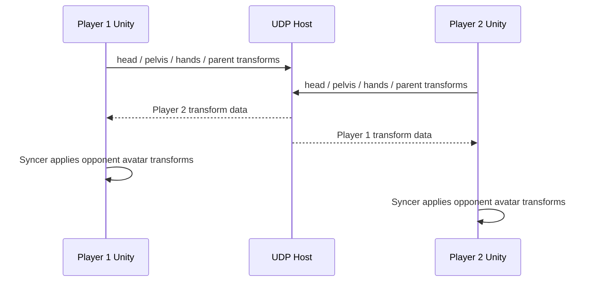

# FMS_Syncer

## 日本語

FMS_Syncer は、VR 協力綱渡りゲームで使った Unity/C# のリアルタイム同期プロトタイプです。2 人のプレイヤーが現実世界でも仮想世界でも同じ棒を持ちながら綱渡りをするために、互いのアバターや棒の位置を UDP 通信で共有します。

参考: https://www.honma.site/ja/works/VRTightrope/

### VR協力綱渡りについて

VR協力綱渡りは、2 人協力プレイの VR 綱渡りゲームです。プレイヤーはペアで同じ棒を持ち、綱の上を渡ります。眼下には Google API で取得した実際の中野の街が広がり、宮下研究室のオープンキャンパスで展示されました。

### このリポジトリの役割

このリポジトリは、ゲーム全体ではなく、プレイヤー間のリアルタイム同期部分を切り出したものです。

- 自分の head / pelvis / hand / parent transform を送信する
- 相手の transform を受信する
- 受信した座標・回転を Unity scene 上の相手アバターに反映する
- UDP で軽量に同期する

### 構成

- `RealtimeCommunication.cs`: UDP 通信、送受信データ構造、同期処理
- `Syncer.cs`: 受信した相手のデータを Transform に反映

### 同期の流れ

`RealtimeCommunication` が自分の Transform を送信し、相手の Transform を受信します。`Syncer` は受信済みの `OpponentData` を scene 上の相手アバターに反映します。

### 同期するデータ

- head position / rotation
- parent position / rotation
- pelvis position
- left hand position
- right hand position

### Unity での使い方

1. `RealtimeCommunication` を GameObject に追加する
2. `parent`, `head`, `pelvis`, `rightHand`, `leftHand` を Inspector で設定する
3. `hostIPAddress`, `hostPort`, player name, timeout, interval を設定する
4. `Syncer` を相手アバター側の GameObject に追加する
5. `RealtimeCommunication` と反映先 Transform を設定する

### 注意

デフォルトの host IP と port がコード内に入っています。展示・ローカル検証・公開環境で使う場合は、接続先とネットワーク設定を必ず確認してください。

## English

FMS_Syncer is a Unity/C# real-time synchronization prototype used in the VR Tightrope cooperative game.

Reference: https://www.honma.site/ja/works/VRTightrope/

### About VR Tightrope

VR Tightrope is a two-player cooperative VR tightrope game. Players hold the same physical/virtual pole and cross a rope together. The city below is based on real Nakano city data retrieved through Google APIs.

### Role of This Repository

This repository contains the synchronization component rather than the full game.

- Sends the local player's head, pelvis, hand, and parent transforms
- Receives the opponent's transform data
- Applies received positions and rotations to the opponent avatar in Unity
- Uses UDP for lightweight real-time communication

### Files

- `RealtimeCommunication.cs`: UDP communication, request/response data, and periodic sync
- `Syncer.cs`: applies received opponent data to scene transforms

### Sync Flow

`RealtimeCommunication` sends the local transforms and receives the opponent transforms. `Syncer` applies the received `OpponentData` to the opponent avatar in the Unity scene.

### Data

It synchronizes head, parent, pelvis, left-hand, and right-hand transform data.

### Unity Usage

Add `RealtimeCommunication` and `Syncer` to appropriate GameObjects, assign transforms in the Inspector, and configure the host IP, port, player name, timeout, and interval.

### Notes

The current script contains a hard-coded default host IP and port. Review those settings before using it outside the original test or exhibition environment.
